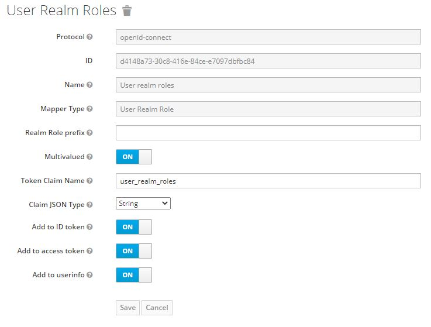
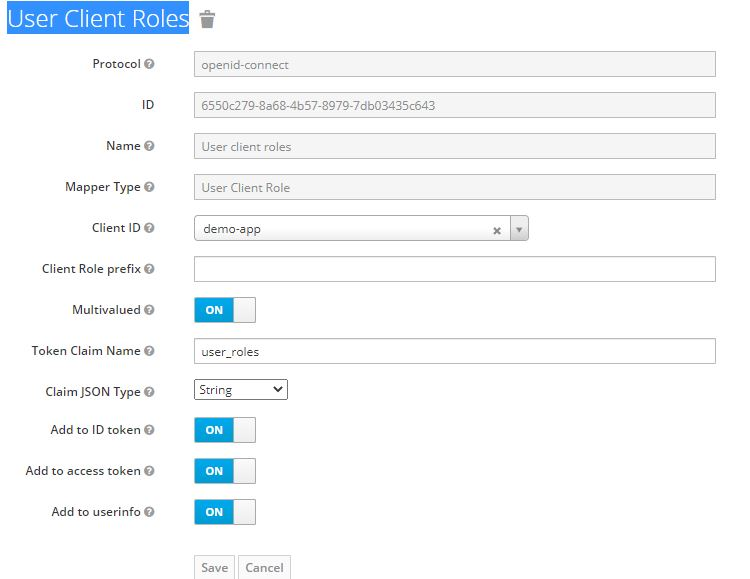
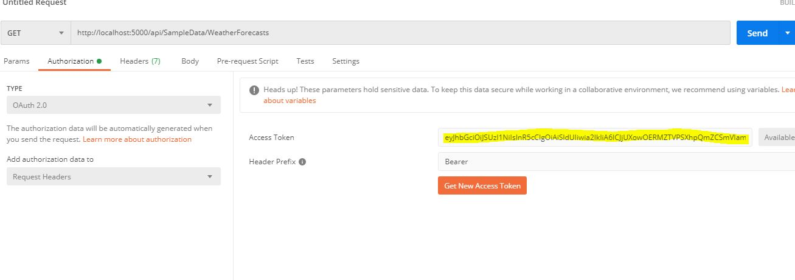

# fullstack-keycloak-with-Asp.Net-Core

## Install Keycloak.

```
docker run -p 8080:8080 -e KEYCLOAK_USER=admin -e KEYCLOAK_PASSWORD=admin quay.io/keycloak/keycloak:11.0.2
```

## Documentation

https://www.keycloak.org/docs/latest/getting_started/index.html

## Create Client in Keycloak.


## Keycloak´s roles

There are two types of roles in Keycloak, Realm roles and Application roles. Realm roles are roles that are setup at “Realm” level, this is useful if you need to “share” roles across applications boundaries. For example, if you have roles that are global to the company, that’s where you’ll want to add them.

To add realm roles, simply connect to Keycloak’s administrative console, select the role for which you want to setup roles and click on the Roles tab. It will list the current roles available in the realm, click on the Add role button. Add the role name, select save and you will have your new role.

Clients roles, are roles that are available only for one specific client application. This is a very likely scenario, as users that are administrators for one application might be a simple users for another. To add client roles, you need to select the Clients menu, then select the client for which you want to add roles. Select the client that we have created for our application in the previous article. Then, select the Roles tab, you should see an empty list. Click Add role and add a role named Administrators. When you save, you should get to the newly created role details.

## Adding a role to a user

Now, let’s get to the Users menu and map a role to a user. In the users list, search for a user and click on its id to get to its details page. From there, select the Role mapping tab and you should see the realm role that you created at the top. Select the client in the drop down list and you should see the Administrators role that you created earlier.
Add both roles to the user.

## Adding the role to the access and id tokens

By default, Keycloak doesn’t publish roles to the id and access tokens, but we will need them to authorize our users in the Asp.Net Core API. This is a configuration that we need to do in Keycloak’s client options. Go back to the .Net Core App client options page and select the Mappers tab you should see a number of built-in mappers.




## Running

1. Run the api demo.api.bearer

```powershell
donet run
```

2. Run the angular-openID-Connect

```powershell
npm install
ng s -o
```

## Authentication from the console and postman

1. Login

```powershell

# Login request
curl   -d "client_id=demo-app"   -d "username=admin"   -d "password=admin"   -d "grant_type=password"   "http://localhost:8080/auth/realms/master/protocol/openid-connect/token"
# response

{
   "access_token":"eyJhbGci ... uwqg",
   "expires_in":60,
   "refresh_expires_in":1800,
   "refresh_token":"eyJhbGci ... OamnQ",
   "token_type":"bearer",
   "not-before-policy":0,
   "session_state":"9156c143-ccce-4a5e-b00a-544322e27be5",
   "scope":"profile email"
}
```

2. Test the api from postman. We should copy the access token and paste in the parameter "Access Token"
   

- Commands:

```powershell
# login
curl \
  -d "client_id=admin-cli<cliente>" \
  -d "username=<usuario>" \
  -d "password=<password>" \
  -d "grant_type=password" \
  "http://localhost:8080/auth/realms/master/protocol/openid-connect/token"

# Get data from realm master
  curl \
  -H "Authorization: bearer <access-token>" \
  "http://localhost:8080/auth/admin/realms/master"

# Refresh token
  curl \
  -d "client_id=admin-cli" \
  -d "refresh_token=<refresh-token>" \
  -d "grant_type=refresh_token" \
  "http://localhost:8080/auth/realms/master/protocol/openid-connect/token"
```

**References**

- Guide:

  - https://medium.com/@xavier.hahn/asp-net-core-angular-openid-connect-using-keycloak-6437948c008
  - https://medium.com/@xavier.hahn/adding-authorization-to-asp-net-core-app-using-keycloak-c6c96ee0e655

- Keycloak.

  - https://www.albertcoronado.com/2020/10/06/identificacion-y-gestion-de-acceso-para-tus-aplicaciones-de-microservicios-con-keycloak-y-oauth2-proxy/

- Asp.net Core examples:

  - **https://github.com/vip32/aspnetcore-keycloak**
  - **https://github.com/thomasdarimont/kc-dnc-demo**
  - **https://github.com/vmaleze/keycloak-dotnetcore**
  - https://github.com/rafaelfgx/Microservices
  - https://github.com/Fosol/keycloak-react
  - https://github.com/gastonsilva/Keycloak_Example_NetCore.Api1
  - https://github.com/juandepalo/Keycloak-aspnetcore
